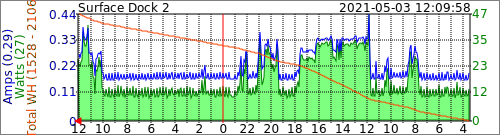

# KasaEnergyLogger
Discover TP-Link Kasa power devices on local network that can monitor energy. Query the discovered devices at regular intervals and log the energy usage. Pull data in MRTG standard format.

## Currently Supported
 - HS110(US)
 - HS300(US)

## Example Log Entries
### HS110
{"date":"2021-05-03 19:06:38","deviceId":"8006D28F7D6C1FC75E7254E4D10B1D1219A9B81D",{"emeter":{"get_realtime":{"current":0.013450,"voltage":122.364188,"power":0,"total":0,"err_code":0}}}}
### HS300 Top Level
{"date":"2021-05-03 19:06:38","deviceId":"80063919963044CFCE2CD1D5402824851D59EB38",{"emeter":{"get_realtime":{"voltage_mv":121851,"current_ma":258,"power_mw":18819,"total_wh":2106,"err_code":0}}}}
### HS300 Child Plug
{"date":"2021-05-03 19:06:38","deviceId":"80063919963044CFCE2CD1D5402824851D59EB3800",{"emeter":{"get_realtime":{"voltage_mv":121785,"current_ma":246,"power_mw":25076,"total_wh":2106,"err_code":0}}}}

Here's an example mrtg graph of the HS300 child plug data

## Direct SVG Output
As of May 2021 the software supports direct output of SVG graphs displaying the power usage over daily, weekly, monthly and yearly periods for each device being monitored. If no SVG directory is specified no graphs are created, and the options (minmax and watthour) related to graph details are ignored. 

## Usage
  KasaEnergyLogger Version 2.20210429-2 Built on: Apr 29 2021 at 09:09:20
  Options:
    -h | --help          Print this message
    -l | --log name      Logging Directory [./]
    -t | --time seconds  time between log file writes [60]
    -v | --verbose level stdout verbosity level [1]
    -r | --runtime seconds time to run before quitting [2147483647]
    -m | --mrtg 8006D28F7D6C1FC75E7254E4D10B1D1219A9B81D Get last value for this deviceId
    -a | --average minutes [5]
    -s | --svg name      SVG output directory
    -x | --minmax graph  Draw the minimum and maximum temperature and humidity status on SVG graphs. 1:daily, 2:weekly, 4:monthly, 8:yearly
    -w | --watthour graph Display the total watt hours on SVG graphs. 1:daily, 2:weekly, 4:monthly, 8:yearly

## Runtime Option
I was having a problem with the program failing to respond after an extended period of running. I've not yet found the issue, but I introduced a workaround when running as a service. The --runtime option tells the program to exit after a specified number of seconds. The service command file is configured to always attempt to restart the program, and passes the runtime parameter of 43200 seconds, which works out to 12 hours. 